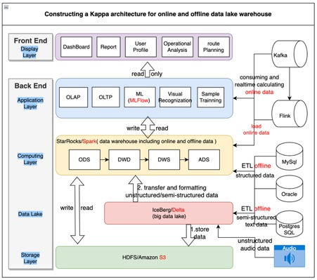
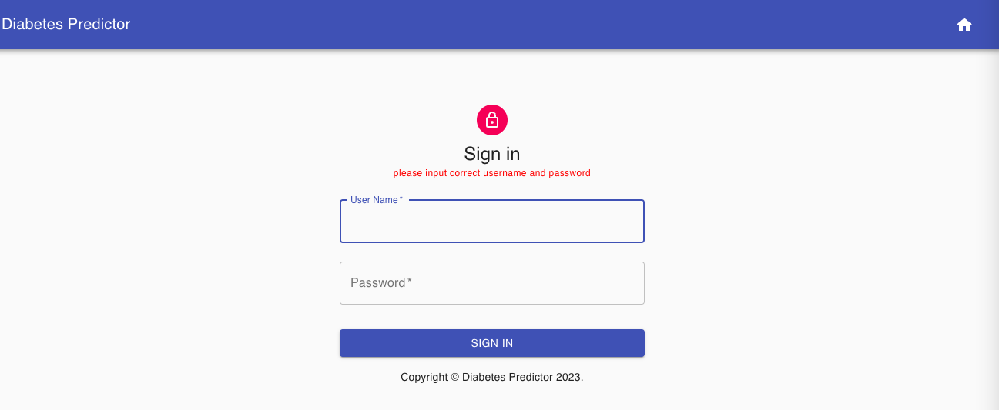
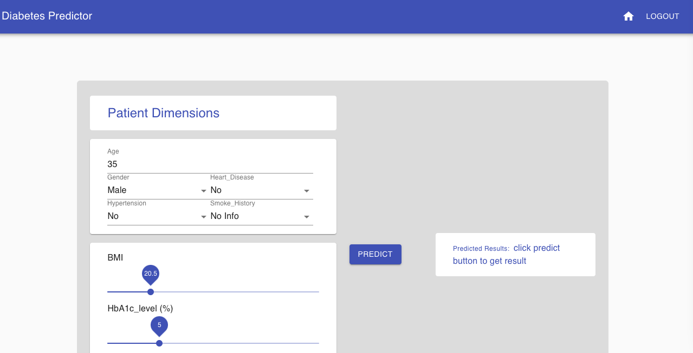
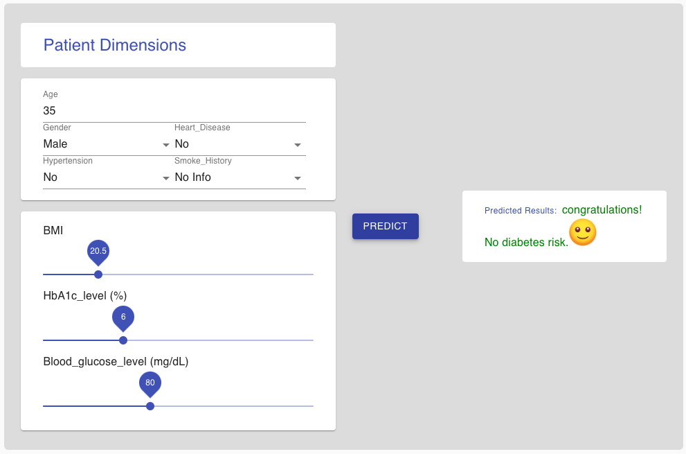
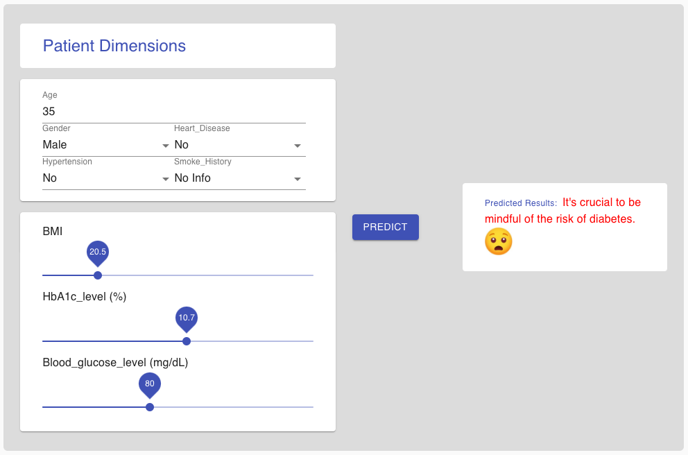

# machine_learning project
## 1. Introduction
This project is developed for diabetes prediction. We use these main streaming components, which are React, Flask, Conda, Jupyter, Pyspark, Sklearn, MLflow, and Delta Lakehouse, to implement the system.
## 2. DataSet
We get the dataset from the Kaggle platform. You can also download diabetes_prediction_dataset.csv from this repository.
## 3. Install libraries
* Python 3.9.18
* Flask 2.2.2
* jupyterlab 3.6.3
* mlflow 2.6.0
* testbook 0.4.2
* selenium 4.15.2
* seaborn 0.12.2
* scikit-learn 1.2.2
* pyspark 3.3.1
* delta-spark 2.2.0
* conda 4.12.0
* npm 9.5.1
* node 18.16.0
* material-ui 4.11.2
* axios 0.21.0
* react 17.0.1
* redux 4.0.5
* pytest 7.4.3
## 4. Train the models
Jupiter file diabetes_prediction.ipynb, you can run the file in Jupiter server
## 5. Test the models
pytest automative_test.py --html=./test_reports/model_and_web_test_report.html

## 6. Architecture diagram

Based on the architecture mentioned in the paper above, it can provide all types of data to support and optimise the process of machine learning applications in various industries. For instance, there are image recognition and classification, natural language processing, recommendation systems, medical diagnosis, financial risk control, industrial manufacturing, autonomous driving, game intelligence, network security, environmental protection, and so on. In this paper, we take the implementation of diabetes prediction in the medical industry as a case study for concrete code implementation.
## 7. Snapshots

 
